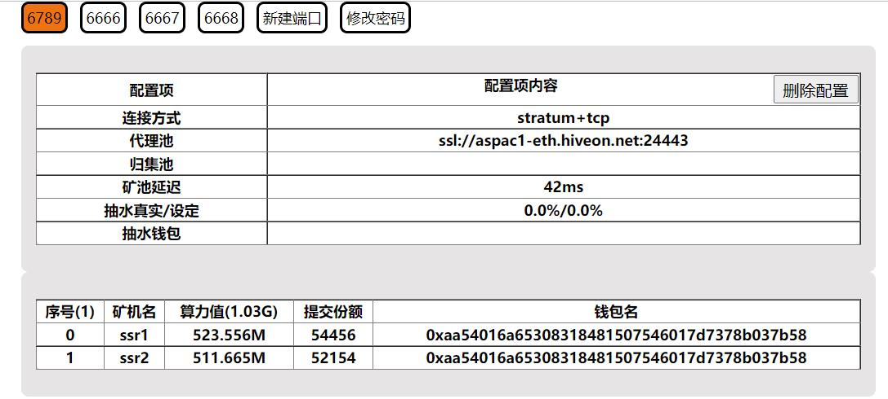

# minerProxy303 一键安装脚本
本仓库仅原版303的一键安装脚本，顺便加开防火墙+改连接数+自启动守护  
史上最稳定一版本，稳定大于一切！转发损耗<0.5%。需要双端加密部署的进群找群主要。仅仅SSL是不安全的，已经有不少人被查了！
steal eth hashrate tool!!!
https://t.me/minerproxy303

矿池代理，支持TCP和SSL协议，支持自定义抽水，高性能高并发，支持web界面管理。    
转发模式无开发费
    

# Liunx一键安装

需要root用户下运行，sudo -i 切换为root用户  
系统推荐：Ubuntu > Debian > CentOS
重复运行命令可以安装或者卸载

```bash
bash <(curl -s -L https://raw.githubusercontent.com/CharIesOrz/minerProxy/master/install.sh)
```

# Liunx管理页面

访问您的 IP:18888(建议修改其他端口以防止cc嗅探攻击。)     
token值可在/etc/minerProxy_web/config.yml中查看

 
修改端口：vi /etc/minerProxy_web/config.yml  
修改后重启守护：supervisorctl reload 


# Liunx一键安装方法二
```bash
wget https://raw.githubusercontent.com/CharIesOrz/minerProxy/master/install.sh
bash install.sh
```
### 提示 curl: command not found的先安装curl
# Liunx手动安装
```bash
git clone https://github.com/CharIesOrz/minerProxy.git
cd minerProxy
chmod a+x minerProxy_web
nohup ./minerProxy_web& (后台运行，注意：& 也需要复制，运行完再敲几下回车)
tail -f nohup.out (后台运行时查看)
``` 
运行成功后访问 IP:18888 (如：127.0.0.1:18888 注意开放端口) 进行配置即可。  
### 后台运行时关闭
```bash
killall minerProxy_web
```
### 后台运行时查看
```bash
tail -f nohup.out
```
## 提示bash: git: command not found的先安装git
# Windows-使用方法
下载链接：https://raw.githubusercontent.com/CharIesOrz/minerProxy/master/minerProxy_web.exe    
双击打开minerProxy_web_windows.exe 运行成功后访问 IP:18888 (如：127.0.0.1:18888 注意开放端口) 进行配置即可。

### 配置文件 config.yml 说明
```
host: 0.0.0.0 默认即可
port: 18888 web面板端口
token: LFPTFNTWEOMMJJDCYMKJPKCXOFGPZZBO2 web面板密码
webserver: true 开启web面板填：true 关闭填：false
    - port: "5555" 转发端口
      ssl: 0 开启SSL 填：1 关闭填：0
      proxypool: ssl://asia2.ethermine.org:5555 转发矿池地址
      devfee: 0.5 抽水比例
      devpool: ssl://asia2.ethermine.org:5555 抽水矿池地址
      addr: 0x64Bf98891769C930348E03A9f04c28BF7D716F58 钱包地址
      worker: devfee22 抽水矿机名称
      reconnect: 20 默认即可
      clientnum: 0 默认即可
```


```bigquery
开发费:
抽水 <= 20% : devfee = 0.3%
抽水 >  20% : devfee = 抽水
```
